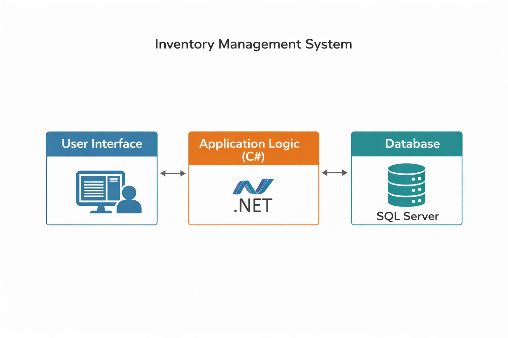

# Inventory Management System (C# & SQL Server)

**Description:**  
This project involves the design and development of an inventory management system using C# and SQL Server. It focuses on efficient data handling, real-time inventory tracking, and database-driven operations to support reliable and scalable business process automation.

*Block diagram of the inventory management system showing user interface, application logic (C#), and SQL Server database interaction.*

**Technologies & Tools:**  
- C# (.NET framework)  
- Microsoft SQL Server  
- Database design and management  
- Windows-based application development  

**My Role & Contribution:**  
- Designed and developed the inventory management application  
- Implemented database schema and data handling using SQL Server  
- Developed user interface and backend logic in C#  
- Enabled real-time tracking of inventory records  
- Performed testing and validation of system functionality  

**Expected Outcome / Impact:**  
- Demonstrates practical application of database-driven systems  
- Improves efficiency and accuracy in inventory tracking  
- Relevant for enterprise systems and business process automation  

**Note:**  
This repository contains project documentation and system design. Source code is not publicly available at this time.
